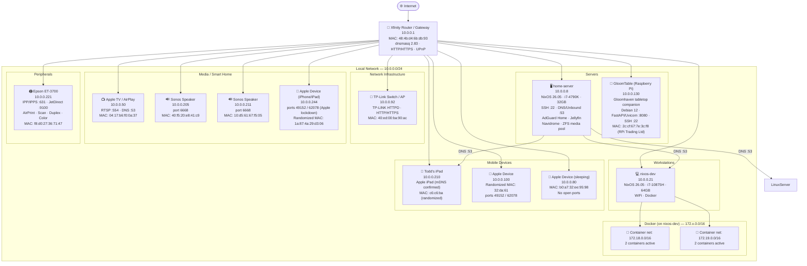

# Home Network Diagram

Generated: 2026-03-05 | Subnet: 10.0.0.0/24

## Device Inventory

| IP | Hostname | Type | Identification Method |
|----|----------|------|-----------------------|
| 10.0.0.1 | gateway | Xfinity router | HTTP banner: "Xfinity Broadband Router Server"; dnsmasq |
| 10.0.0.8 | home-server | NixOS server | SSH, confirmed |
| 10.0.0.21 | nixos-dev | NixOS laptop | Local host |
| 10.0.0.50 | — | Apple TV / AirPlay device | RTSP :554, Apple OUI (04:17:b6) |
| 10.0.0.80 | — | Apple device (sleeping) | Apple OUI (b0:a7:32), no open ports |
| 10.0.0.92 | — | TP-Link switch/AP | HTTP banner: "TP-LINK HTTPD/1.0" |
| 10.0.0.100 | — | Apple mobile device | Ports 49152/62078 (Apple lockdown), randomized MAC |
| 10.0.0.130 | GloomTable | Raspberry Pi — Gloomhaven tabletop companion | HTTP title "GloomTable", FastAPI/Uvicorn :8080, OpenSSH 9.2p1 Debian 12, OUI: RPi Trading Ltd |
| 10.0.0.205 | — | Sonos speaker | Port 6668 (Sonos protocol) |
| 10.0.0.210 | Todds-iPad | Apple iPad | mDNS: `Todds-iPad.local`, companion-link service |
| 10.0.0.211 | — | Sonos speaker | Port 6668 (Sonos protocol) |
| 10.0.0.221 | EPSON367147 | Epson ET-3700 printer | mDNS confirmed, IPP/AirPrint |
| 10.0.0.244 | — | Apple iPhone/iPad | Ports 49152/62078 (Apple lockdown), randomized MAC |
